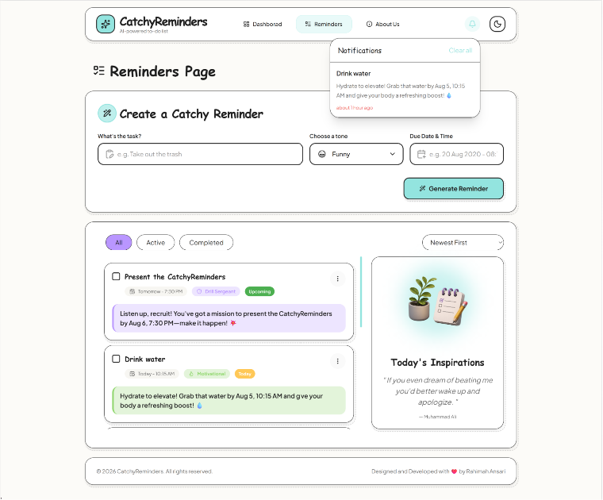

# CatchyReminders

An AI-powered reminder platform that transforms ordinary tasks into fun, engaging, and memorable reminders.

Instead of showing boring task descriptions, **CatchyReminders** uses AI to rewrite reminders with different personalities and writing styles:

- Funny
- Motivational
- Pirate
- Movie Trailer
- Drill Sergeant
- Custom

The goal is to make everyday tasks more enjoyable and easier to remember.

---

## Project Architecture

CatchyReminders is divided into two main parts:

```text
catchy-reminders/
├── frontend/
│   └── React + Vite application
│       ├── User interface
│       ├── Reminder management
│       ├── Theme system
│       └── Local Storage persistence
│
└── worker/
    └── Cloudflare Worker API
        ├── Secure API layer
        ├── OpenRouter communication
        └── Server-side API key management
```

The request flow:

```
User
 |
 ↓
React Frontend
 |
 |  { task, tone, dueAt }
 ↓
Cloudflare Worker
 |
 |  Secret API Key
 ↓
OpenRouter API
 |
 ↓
AI Generated Reminder
 |
 ↓
Frontend Display
```

The Worker acts as a secure bridge between the application and the AI service.

---

## Tech Stack

### Frontend

- React
- Vite
- Tailwind CSS
- React Router DOM
- React Context API
- framer-motion
- react-icons
- react-datepicker
- date-fns
- lucide-react
- Local Storage

### Worker

- Cloudflare Workers
- Wrangler CLI
- OpenAI SDK
- OpenRouter API
- JavaScript

---

## Screenshot

   


## Features

### AI Reminder Generation

Convert simple tasks into creative reminders:

Example:

**Input**

```
Clean my room
```

**Output**

```
Captain, your room awaits its legendary transformation. 
Prepare for battle and restore order!
```

---

### Reminder Management

- Create reminders
- Generate AI messages
- Select different AI personalities
- Mark tasks as completed
- Delete reminders
- Copy reminder text
- Save reminders locally

---

### User Experience

- Responsive design
- Modern UI
- Light/Dark theme
- Animated components
- Clean navigation
- Persistent data storage

---

# Installation

## 1. Clone the repository

```bash
git clone https://github.com/Rahimah-98/catchy-reminders.git

cd catchy-reminders
```

---

# Worker Setup

The Worker must run first because the frontend communicates with it.

```bash
cd worker

npm install
```

open the  `.dev.vars.example` file and use below command:

```bash
npx wrangler secure put OPENROUTER_API_KEY    after that enter it's value
```

Get your API key from:

```
https://openrouter.ai/keys
```


Start the Worker:

```bash
npx wrangler dev
```

The Worker runs at:

```
http://localhost:8787
```

---

# Frontend Setup

Open another terminal:

```bash
cd frontend

npm install
```

Create a `.env` file:

```env
VITE_WORKER_URL=http://localhost:8787
```

Start the development server:

```bash
npm run dev
```

Open:

```
http://localhost:5173
```

---

# Development Commands

## Frontend

Run development server:

```bash
npm run dev
```

Build production version:

```bash
npm run build
```

Preview production build:

```bash
npm run preview
```

Lint:

```bash
npm run lint
```

---

## Worker

Run locally:

```bash
npx wrangler dev
```

Deploy:

```bash
npx wrangler deploy
```
---

# Deployment

The application is deployed using Cloudflare services.

```
Frontend
   ↓
Cloudflare Pages

Worker API
   ↓
Cloudflare Workers
```

---

# Security

The OpenRouter API key is stored only in the Worker environment.

The frontend sends:

```json
{
  "task": "Wash the dishes",
  "tone": "Funny"
}
```

The Worker handles:

- API authentication
- OpenRouter requests
- AI response generation

The API key is never exposed in the browser.

---

# Future Improvements

- User authentication
- Reminder categories
- Search functionality
- Favorite reminders
- Reminder editing
- Drag-and-drop organization

---

# Deployment Link:  https://catchy-reminders.pages.dev/


---


## License

This project is for educational and portfolio purposes.